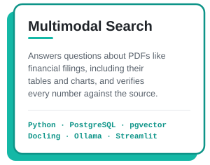
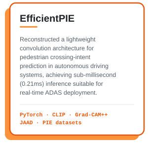
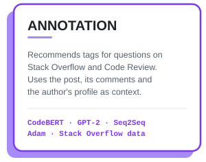

<!-- ═════════════ HEADER ═════════════ -->

  

 

<h3>MS CS @ UW–Madison &nbsp;•&nbsp; Ex-Software Engineer @ Optum</h3>

<!-- ═════════════ ABOUT ═════════════ -->
## About Me

- MS Computer Science student at **UW–Madison**
- Former Software Engineer at **Optum**
- Currently into **NLP, AI Agents** and **ML + Systems**
- Research: Recommender systems and personalization. Published in *Information and Software Technology* (2026): "Transformer-aware Sequence-to-Sequence Network for Personalized Tag Recommendation in Software Information Sites" ([link](https://www.sciencedirect.com/science/article/abs/pii/S0950584926000509?via%3Dihub)).
- Looking for **full-time SWE / ML roles starting May 2027**

<!-- ═════════════ TECH STACK ═════════════ -->
## Tech Stack

**Languages & Databases**

**Frameworks & Tools**

**Libraries**

<!-- ═════════════ PINNED PROJECTS ═════════════ -->
## Featured Projects

 

  

